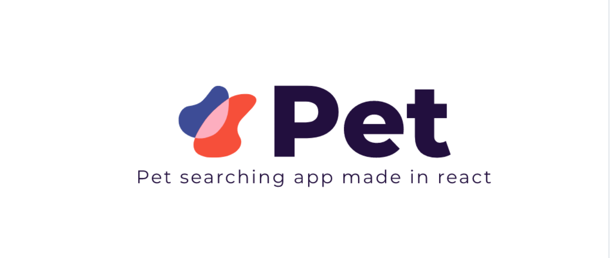

<p align="center" >

</p>

<p align="center">
  <a href="https://github.com/kamranahmedse/githunt">
    
  </a>
  <a href="https://github.com/junipdewan/githunt/blob/master/license.md">
    
  </a>
</p>


# Pet
A web app to search Pet using Petfinder API.

## Prerequisites

You are required to have [Node.js](https://nodejs.org/) installed to run the app locally.

## Getting Started

Install [petfinder-client](https://www.npmjs.com/package/petfinder-client) 
```
npm install petfinder-client --save
```

## Getting API keys

Register in [PetfinderAPI](https://www.petfinder.com/developers/api-key) to get API keys. Petfinder API allows you to search their database for available pets ready for adoption.

Make a new `.env` file and do the following

```
 API_KEY = your_api_key
 API_SECRET = your_api_secret
```

## Usage

```sh
# install project dependancy
~/ npm install

# Now run the app
~/ npm run dev 

```
## Formatting

```sh
npm run format
```

## Clear Build

```sh
npm run clear
```